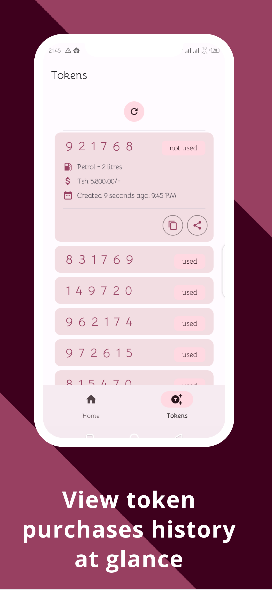

# The Hinju App

[](https://opensource.org/licenses/MIT)

<div style="display: flex; align-items: center;">
  
  <div style="margin-left: 20px;">
    <p>
      Welcome to The Hinju App repository! This repository houses the source code for our revolutionary app that simplifies the process of buying gas (diesel and petrol). Say goodbye to cash payments and embrace a convenient and secure digital experience.
    </p>
    <p>
      <a href="https://play.google.com/store/apps/details?id=com.samtechs.thehinjuapp">
        
      </a>
    </p>
  </div>
</div>


## Screenshots

<div style="display: flex; justify-content: center;">
  
  
  
  
  
</div>


## Key Features

- **Effortless Gas Purchases**: Purchase gas anytime, anywhere with just a few taps on your smartphone.
- **Secure Digital Tokens**: Enjoy safe and reliable transactions with unique encrypted tokens.
- **Track and Redeem Tokens**: Easily monitor your token usage and redeem them at participating fuel stations.
- **Convenient Account Management**: Manage your account, payment methods, and transaction history with ease.
- **Enhanced User Experience**: Enjoy a modern and intuitive user interface for a seamless fueling experience.
- **Customer Support**: Responsive support team to assist you with any questions or issues.

## Installation

1. Clone the repository:
   ```bash
   git clone https://github.com/samueldanda/the-hinju-app.git
   ```

2. Open the project in Android Studio.

3. Build and run the app on your device or emulator.

## Contributing

We welcome contributions to The Hinju App! To contribute, please follow these steps:

1. Fork the repository.

2. Create a new branch for your feature or bug fix:
   ```bash
   git checkout -b my-feature
   ```

3. Make the necessary changes and commit them:
   ```bash
   git commit -m "Add new feature"
   ```

4. Push your changes to your branch:
   ```bash
   git push origin my-feature
   ```

5. Submit a pull request detailing your changes.

## License

This project is licensed under the [MIT License](https://opensource.org/licenses/MIT).

## Contact

Have any questions or suggestions? Feel free to reach out to our team at [your-email@example.com](mailto:dandasamuel1@gmail.com).

We appreciate your interest in The Hinju App. Happy fueling!

Remember to customize the content with your app's specific details, including installation instructions, contributing guidelines, and contact information.
